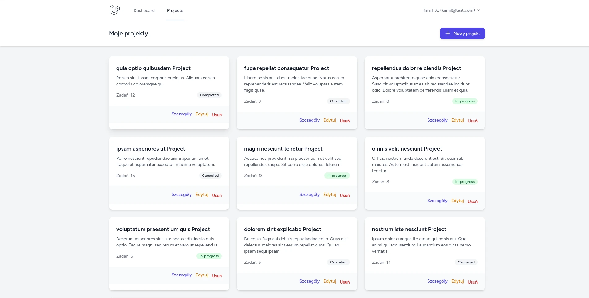
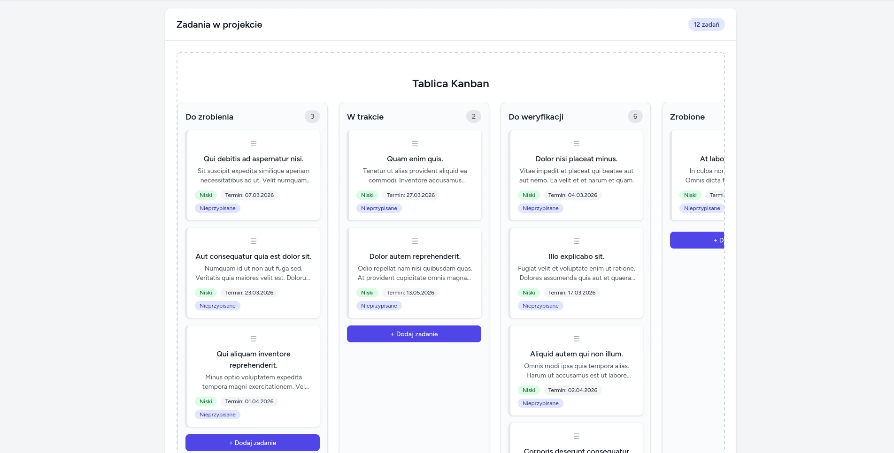
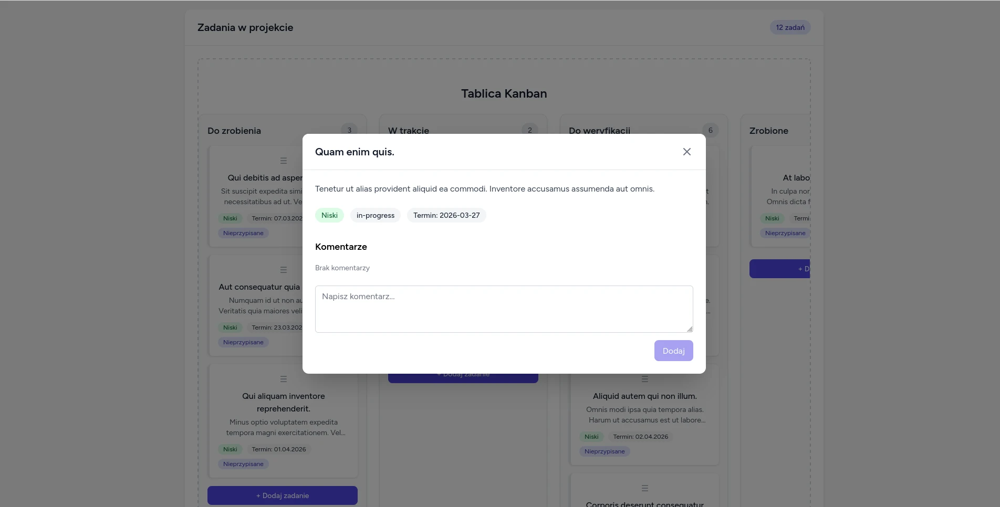

# Project Manager – Aplikacja do zarządzania projektami

  


Prosta, nowoczesna aplikacja typu Kanban do zarządzania projektami i zadaniami.  
Stworzona jako projekt portfolio, demonstrująca praktyczne użycie **Laravel 11/12** + **Tailwind CSS** + Blade + Alpine.js.

## Główne funkcjonalności

- Rejestracja i logowanie użytkowników (Laravel Breeze)
- Tworzenie, edycja i usuwanie projektów
- Tablica Kanban z drag & drop (kolumny: To Do / In Progress / Done)
- Zarządzanie zadaniami: tytuł, opis, priorytet, termin, przypisanie do użytkownika
- Komentarze pod zadaniami
- Responsywny design + tryb ciemny (Tailwind dark mode)
- Powiadomienia w aplikacji / e-mail (opcjonalnie)
- Wyszukiwanie i filtrowanie zadań/projektów

## Technologie

- **Backend**: Laravel 11 / 12, Eloquent ORM, Laravel Breeze, Notifications
- **Frontend**: Tailwind CSS v3/v4, Blade components, Alpine.js
- **Baza danych**: MySQL / SQLite / PostgreSQL
- **Inne**: Sortable.js (drag & drop), Laravel Sail

## Demo / Zrzuty ekranu

| Dashboard użytkownika              | Tablica Kanban projektu            | Widok szczegółowy zadania          |
|------------------------------------|------------------------------------|------------------------------------|
|  |  |  |


## Instalacja i uruchomienie lokalnie

### Wymagania

- PHP ≥ 8.2
- Composer
- Node.js + npm
- MySQL / SQLite / PostgreSQL

### Kroki

1. Sklonuj repozytorium

```bash
   git clone https://github.com/kamilszwaradzki/project-manager.git
   cd project-manager
```
2. Zainstaluj zależności
```bash
composer install
npm install
```
3. Skopiuj plik .env i skonfiguruj
```Bash
cp .env.example .env
```
W pliku `.env` ustaw:
* połączenie z bazą danych (`DB_*`)
* `APP_URL=http://localhost`

4. Wygeneruj klucz aplikacji
```bash
php artisan key:generate
```
5. Uruchom migracje i seedery (opcjonalnie)
```bash
php artisan migrate --seed
```
6. Skompiluj assety
```bash
npm run dev
# lub w produkcji:
npm run build
```
7. Uruchom serwer
```bash
php artisan serve
# albo użyj Laravel Sail
```
Aplikacja powinna być dostępna pod: http://localhost:8000

## Struktura Projektu
```
app/                  ← Modele, serwisy, kontrolery
database/migrations   ← Migracje bazy danych
resources/views       ← Widoki Blade + komponenty
resources/css         ← Tailwind (app.css)
public/               ← Assety publiczne
routes/               ← Definicje tras (web.php)
tests/                ← Testy (opcjonalnie)
```
## Co warto jeszcze dodać?
* Testy automatyczne (Pest)
* CI/CD (GitHub Actions)
* Deploy na Vercel / Forge / Railway / Laravel Vapor
* Dokumentacja API (endpointy REST / Sanctum)

## Autor
**Kamil Szwaradzki** \
Portfolio: https://code4all.eu \
GitHub: https://github.com/kamilszwaradzki \
LinkedIn: https://linkedin.com/in/kamil-szwaradzki

## Licencja
MIT License – możesz swobodnie używać kodu do celów edukacyjnych i komercyjnych (z zachowaniem dobrej praktyki – podaj źródło jeśli mocno przerabiasz).